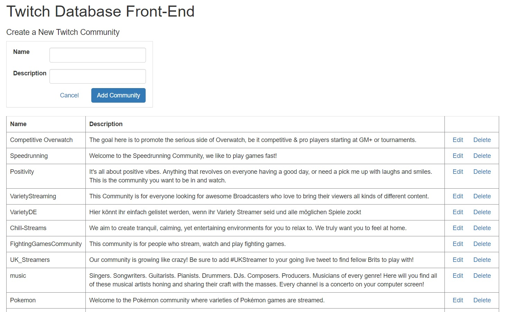

# twitchdb_frontend
A front end application for Twitch database

## Deployment
This application is not currently hosted so to run it:
1. Clone the repo
2. Install Microsoft WebMatrix
3. Open the cloned repo
4. Hit 'Run'

The app will be running on a randomly assigned localhost port

## Application Screenshot
